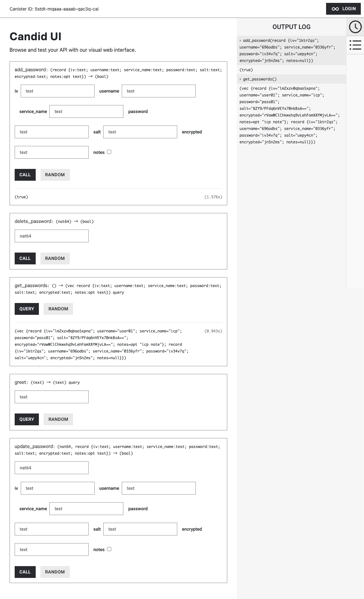
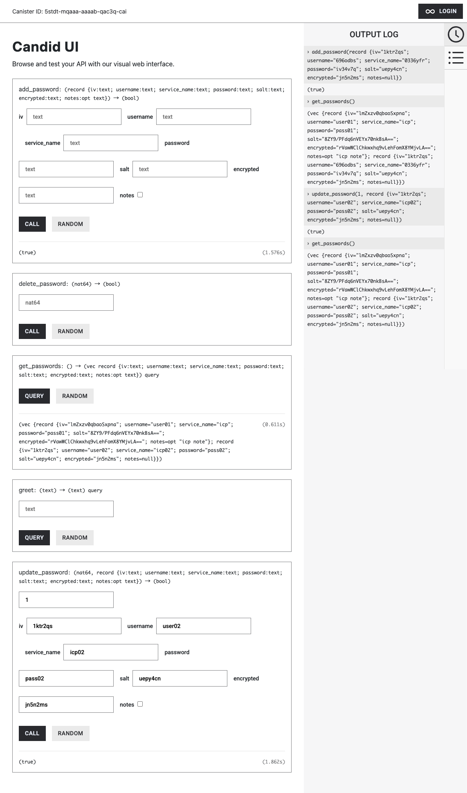
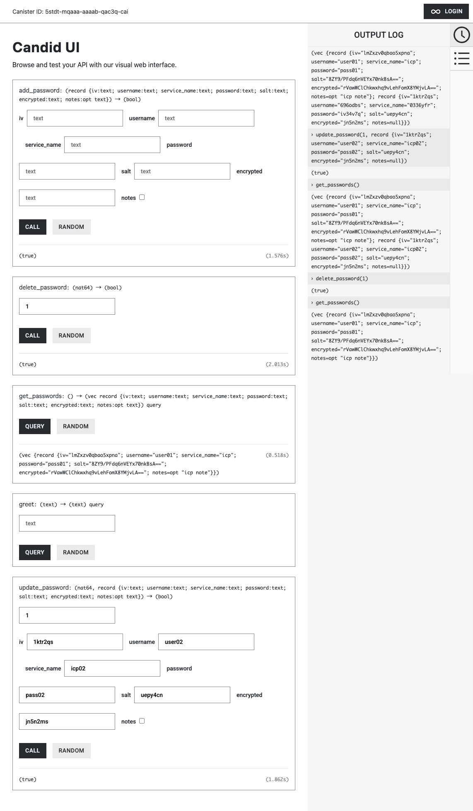
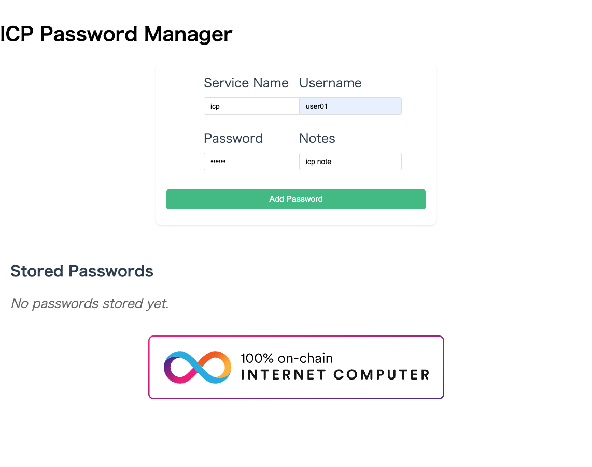
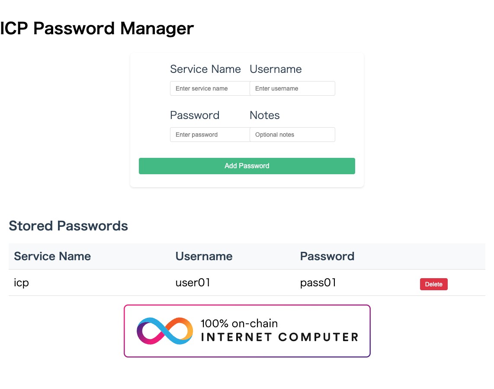

# ICP Password Manager

## 前提条件

### devcontainer を利用する。

1. wave03/dev-icp-hackathon 内をvscode または cursor で開く。
2. devcontainerを開く。

以下の画面の「コンテナーで再度開く」をクリックする。


コンテナ起動後の環境に関しては以下の通り。

```
dfx --version
```

```
dfx 0.25.0
```

最新バージョンにアップデートする方法は以下の通り。

```
dfxvm update
```

cargo のバージョン確認

curl --proto '=https' --tlsv1.2 -sSf https://sh.rustup.rs | sh -s -- -y

```
cargo --version
```

cargo 1.85.0 (d73d2caf9 2024-12-31)


## playground へのDeploy方法

playground へのDeploy 方法は以下の通り。

```
dfx deploy --playground
```

playground へDeployしたcanisterのMethodをコマンドラインから実行することができる。
例えば、playground へDeployした icpassproj_backend canister のMethod: greet をコールする方法は以下の通り。

```
dfx canister --network playground call icpassproj_backend greet '("everyone in playground")'
```

以下のURLが生成されるので、そちらにアクセスする。

```
Upgraded code for canister icpassproj_frontend, with canister ID 475h5-dyaaa-aaaab-qac4a-cai
Deployed canisters.
URLs:
  Frontend canister via browser:
    icpassproj_frontend: https://475h5-dyaaa-aaaab-qac4a-cai.icp0.io/
  Backend canister via Candid interface:
    icpassproj_backend: https://a4gq6-oaaaa-aaaab-qaa4q-cai.raw.icp0.io/?id=5stdt-mqaaa-aaaab-qac3q-cai
```

## Backend canister

まずは、Backend canisterの場合は以下のように表示される。

add_password, get_passwords を実行した結果は以下のとおり。




次に update_password, get_passwords を実行した結果 を実行した結果は以下のとおり。



update_password でindex: 1 を指定して更新した結果が反映されていることが確認できる。




delete_password でindex: 1 を指定して更新した結果が反映されていることが確認できる。

## Frontend canister

次に Frontend canisterの場合は以下のように表示される。

パスワードを入力し、Add Password をクリックする。




パスワード保存に成功した旨のアラートが表示される。


保存結果が一覧に表示される。




## Local Canister実行環境の起動

```
dfx start --clean --background
```

```
Running dfx start for version 0.25.0
Using the default configuration for the local shared network.
Initialized replica.
Initialized HTTP gateway.
Replica API running on 127.0.0.1:4943
Success! The dfx server is running in the background.
```

### Local Canister実行環境へのdeploy


vetkd のsystem api のDeploy

ちょっとわからないが、本番でローンチされていないようなのでsystem api をそのまま利用する。

dfx canister create vetkd_system_api --specified-id s55qq-oqaaa-aaaaa-aaakq-cai


dfx deploy vetkd_system_api --specified-id s55qq-oqaaa-aaaaa-aaakq-cai


dfx canister delete vetkd_system_api


```
URLs:
  Frontend canister via browser:
    icpassproj_frontend:
      - http://bd3sg-teaaa-aaaaa-qaaba-cai.localhost:4943/ (Recommended)
      - http://127.0.0.1:4943/?canisterId=bd3sg-teaaa-aaaaa-qaaba-cai (Legacy)
    internet_identity:
      - http://be2us-64aaa-aaaaa-qaabq-cai.localhost:4943/ (Recommended)
      - http://127.0.0.1:4943/?canisterId=be2us-64aaa-aaaaa-qaabq-cai (Legacy)
  Backend canister via Candid interface:
    icpassproj_backend: http://127.0.0.1:4943/?canisterId=b77ix-eeaaa-aaaaa-qaada-cai&id=bkyz2-fmaaa-aaaaa-qaaaq-cai
    internet_identity: http://127.0.0.1:4943/?canisterId=b77ix-eeaaa-aaaaa-qaada-cai&id=be2us-64aaa-aaaaa-qaabq-cai
    secrets_backend: http://127.0.0.1:4943/?canisterId=b77ix-eeaaa-aaaaa-qaada-cai&id=br5f7-7uaaa-aaaaa-qaaca-cai
    vetkd_system_api: http://127.0.0.1:4943/?canisterId=b77ix-eeaaa-aaaaa-qaada-cai&id=bw4dl-smaaa-aaaaa-qaacq-cai
```


cargo install cargo-audit


普通に deploy すると適当なIDが生成されてしまうので、internet identity のCanister id を適当な以下のIDでDeployする。

dfx deploy internet_identity --specified-id bkyz2-fmaaa-aaaaa-qaaaq-cais

Login.vue でIDが一致するように指定する。

```
authClient.login({
    identityProvider: "http://bkyz2-fmaaa-aaaaa-qaaaq-cai.localhost:4943/",
```


https://internetcomputer.org/docs/tutorials/developer-liftoff/level-2/2.3-third-party-canisters


まず、プロジェクトのディレクトリにある dfx.json ファイルを開きます。
dependencies_backend キャニスターがメインネット上の internet_identity キャニスター (rdmx6-jaaaa-aaaaa-aaadq-cai) に依存するように構成する必要があります。

このシリーズでは、後のチュートリアルでインターネット ID についてさらに詳しく説明しますが、今は、サードパーティのキャニスターの使用方法を示すために使用します。dfx.json ファイルを編集して、次の構成を反映します。


canister を追加したときは icpassproj/src/declarations は削除するとdeployしたときに生成される。

canister を追加するときは dfx.json のcanisters に記載する。

```
"canisters": {
    "encrypted_passwords_motoko": {
      "main": "src/encrypted_passwords_motoko/main.mo",
      "type": "motoko"
    }
  }
```


特定のcanister をdeploy したいとき

```
dfx deploy secrets_backend
```


```
Committing batch with 13 operations.
Deployed canisters.
URLs:
  Frontend canister via browser
    icpassproj_frontend:
      - http://127.0.0.1:4943/?canisterId=bd3sg-teaaa-aaaaa-qaaba-cai
      - http://bd3sg-teaaa-aaaaa-qaaba-cai.localhost:4943/
  Backend canister via Candid interface:
    icpassproj_backend: http://127.0.0.1:4943/?canisterId=be2us-64aaa-aaaaa-qaabq-cai&id=bkyz2-fmaaa-aaaaa-qaaaq-cai
```


dfx deploy secrets_backend


## Step 8: Update the generated canister interface bindings:

```sh
dfx generate "secrets_backend"
dfx generate "icpassproj_backend"
dfx generate "vetkd_system_api"
```


## Backend側のテスト実行方法

以下のディレクトリに移動する。

```
cd /src/icpassproj/src/icpassproj_backend
```

テストメソッドを全てテストを実行する方法は以下の通り。

```
cargo test --package icpassproj_backend --test integration_test -- --show-output
```

各テストメソッドごとにテストを実行する方法は以下の通り。

```
cargo test --package icpassproj_backend --test integration_test -- test_hello_world --exact --show-output
cargo test --package icpassproj_backend --test integration_test -- test_add_password --exact --show-output
cargo test --package icpassproj_backend --test integration_test -- test_get_passwords --exact --show-output
cargo test --package icpassproj_backend --test integration_test -- test_update_password --exact --show-output
cargo test --package icpassproj_backend --test integration_test -- test_delete_password --exact --show-output
```


dfx deploy internet_identity --argument '(null)'

今後の構想

web3 <- -> web2 : の連携し、internet identity でログインしたらOauth みたいに他のサービスにログインできるようにしたい

Port 番号を利用しているか

lsof -i :4943
lsof -i :4949

dfx start --clean --host 127.0.0.1:4949

cd streamingservice
dfx deploy

sudo apt update
sudo apt install ffmpeg

ffprobe -v error -select_streams v:0 -show_entries stream=codec_name,codec_tag_string -of default=noprint_wrappers=1:nokey=1 "./videos/IC Hello Starter - Brave 2025-04-22 00-18-55.mp4"

h264
avc1

ffprobe -v error -select_streams v:0 -show_entries stream=codec_name,codec_tag_string -of default=noprint_wrappers=1:nokey=1 "./videos/You are coding a new exciting project  The Social Network YouTube - Brave 2025-04-23 23-55-47.mp4"


ffmpeg -i "./videos/The-Social-Network.mp4" -b:v 1M -c:a copy -f hls -hls_playlist_type vod -hls_time 5 -g 24 -hls_segment_filename "./videos/The-Social-Network-1m%3d.ts" "./videos/The-Social-Network-1m.m3u8"


ffmpeg -i "./videos/IC Hello Starter - Brave 2025-04-22 00-18-55.mp4" -b:v 1M -c:a copy -f hls -hls_playlist_type vod -hls_time 5 -g 24 -hls_segment_filename "./videos/IC Hello Starter - Brave 2025-04-22 00-18-55%3d.ts" "./videos/IC Hello Starter - Brave 2025-04-22 00-18-55-1m.m3u8"

ffmpeg -i "./videos/IC-Hello-Starter.mp4" -b:v 1M -c:a copy -f hls -hls_playlist_type vod -hls_time 5 -g 24 -hls_segment_filename "./videos/IC-Hello-Starter-%3d.ts" "./videos/IC-Hello-Starter-1m.m3u8"

ffmpeg -i "./videos/Narita.mp4" -b:v 1M -c:a copy -f hls -hls_playlist_type vod -hls_time 5 -g 24 -hls_segment_filename "./videos/Narita-1m%3d.ts" "./videos/Narita-1m.m3u8"


https://ffmpegwasm.netlify.app/docs/getting-started/usage


cd /src/streamingservice/src/streamingservice_frontend

npm install @ffmpeg/ffmpeg @ffmpeg/util

