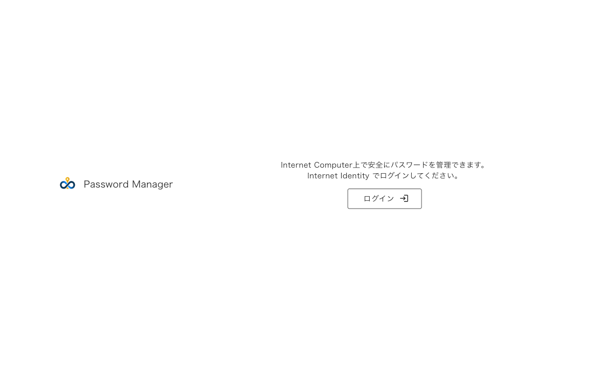
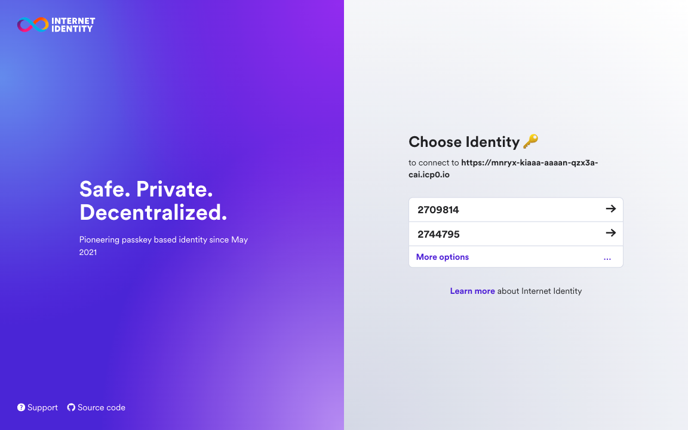
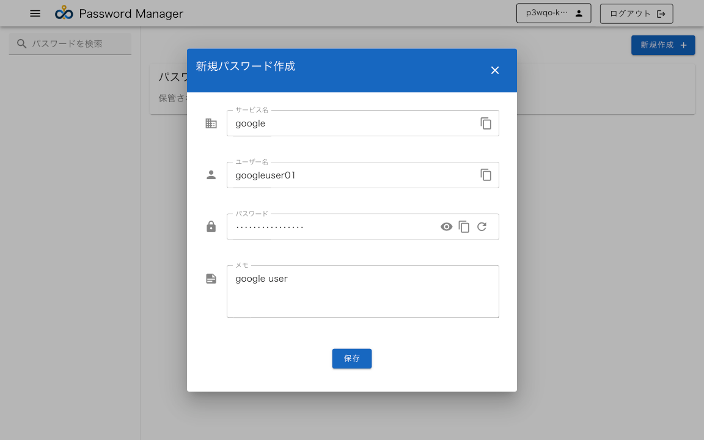
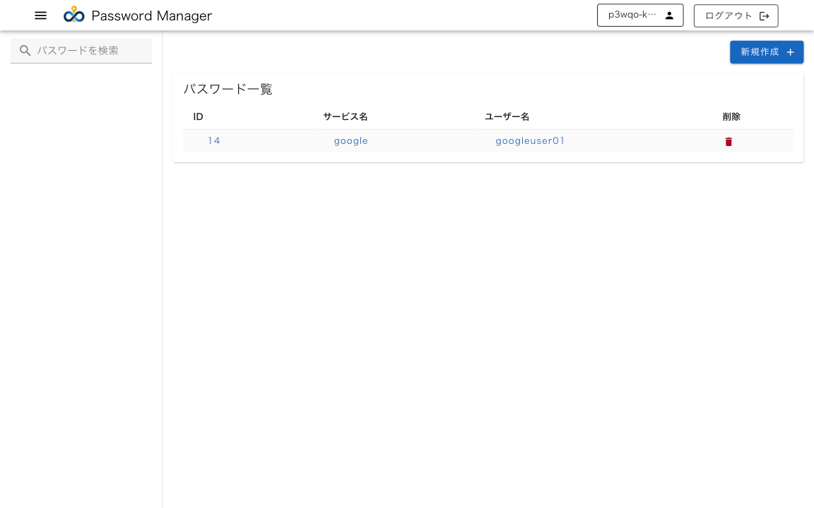
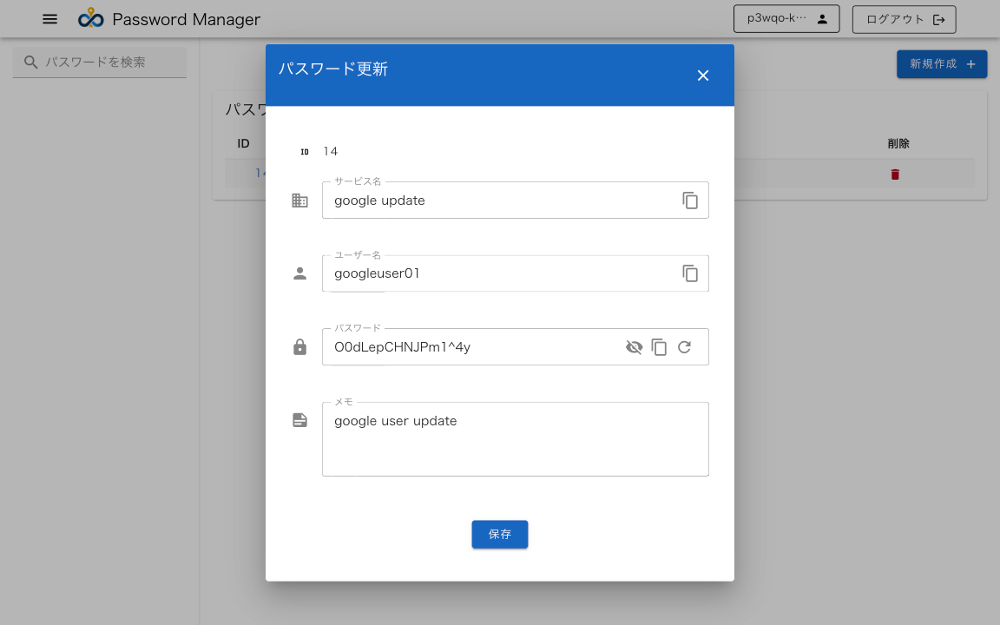
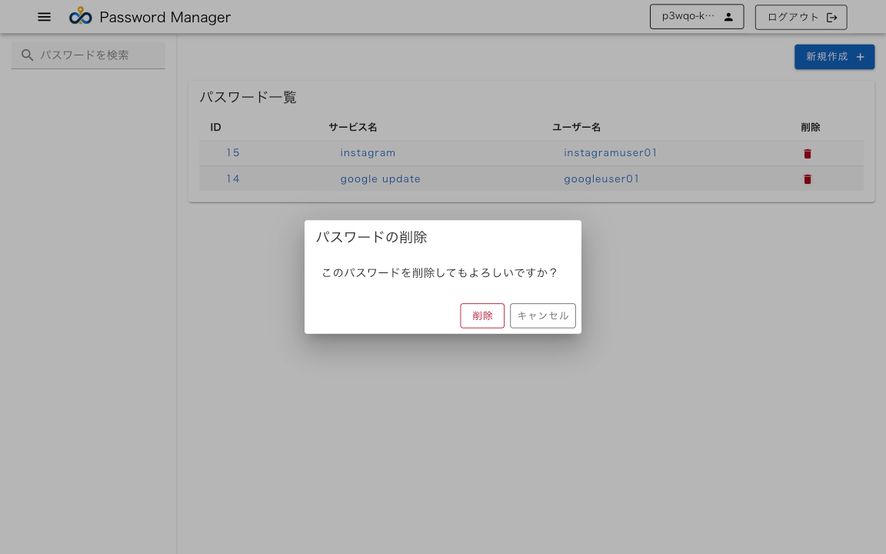
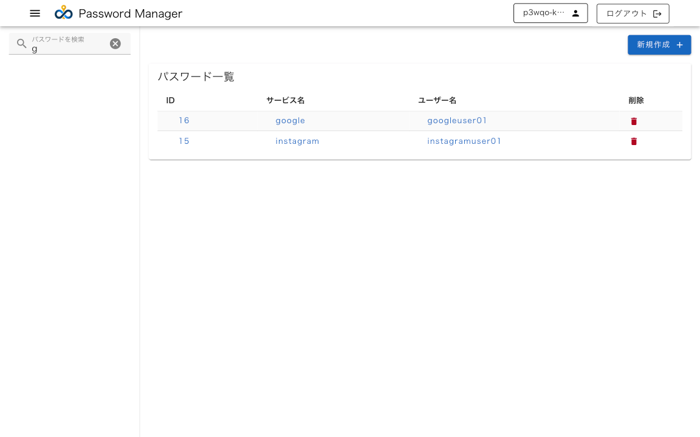
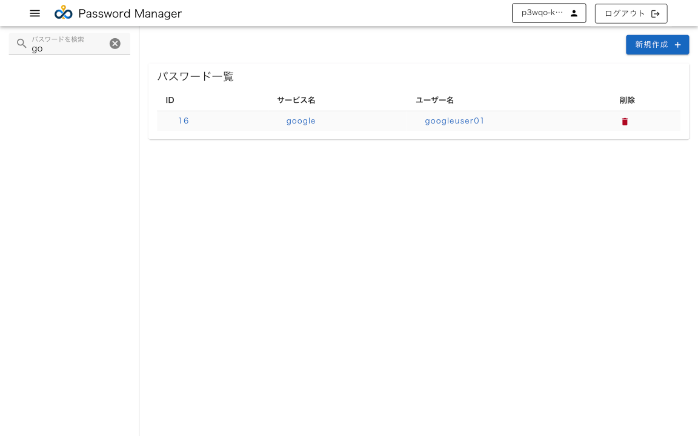
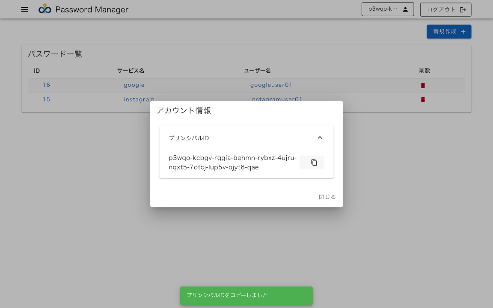

# ICP Password Manager

Internet Identity と vetkey を利用したPassword Managerである。vetkey は [ic-vetkd-utils-wasm2js](https://www.npmjs.com/package/ic-vetkd-utils-wasm2js) や [vetkd-system-api](https://github.com/dfinity/examples/tree/master/rust/vetkd/src/system_api) を利用している。

## mainnet でのデモ環境

以下のURLからアクセスすることができる。

https://mnryx-kiaaa-aaaan-qzx3a-cai.icp0.io/

canister の情報は以下の通り。

| canister 名 | URL | 説明 |
| --- | --- | ---- |
| icpassproj_frontend | https://mnryx-kiaaa-aaaan-qzx3a-cai.icp0.io/ | Password Manager の Frontend canister |
| icpassproj_backend | https://a4gq6-oaaaa-aaaab-qaa4q-cai.raw.icp0.io/?id=mestl-4aaaa-aaaan-qzx2q-cai | Password Manager の Backend canister |
| secrets_backend | https://a4gq6-oaaaa-aaaab-qaa4q-cai.raw.icp0.io/?id=mkq6d-hqaaa-aaaan-qzx3q-cai | Password Manager の Backend canister. vetkd_system_api のcanister との通信によって文字列の暗号化、復号を行う。 |
| vetkd_system_api | https://a4gq6-oaaaa-aaaab-qaa4q-cai.raw.icp0.io/?id=nh62n-iyaaa-aaaan-qzx4a-cai | https://github.com/dfinity/interface-spec/pull/158 で提案されているvetkd system api を利用している。 |

## サービスコンセプト

Internet Identity と vetkey を利用したパスワードマネージャを提供する。
これまでの特定のサービスが管理するパスワードマネージャやキー管理サービスを個人のデバイスに紐づくキー管理を行う。

## 利用ユーザ想定（ターゲット）

- Internet Identity でのログインをし、パスワード管理をしたいユーザ
- セキュアにキー管理をしたいユーザ
- パスワード入力が必要な既存のサービスでログインする際に自動入力したいユーザ

## メリット、特徴

### 主な特徴

- Internet Identityとvetkeyによるセキュアなパスワードマネージャー
- 3層構造のcanisterアーキテクチャ（フロントエンド、バックエンド、vetkd system api）
- マルチプラットフォーム対応（PCブラウザ、モバイルブラウザ）

### 機能面のメリット

- 直感的なパスワード管理（作成、更新、削除、検索）
- 便利な補助機能（パスワードの自動生成、コピー、表示/非表示切替）

### セキュリティ面のメリット

- Internet Identityによる安全な認証システム
- vetkeyを使用したキー管理
- バックエンドcanisterでの暗号化・復号処理による安全性確保

## ICPの仕組みで特徴的な利用箇所

以下の機能を利用している。

- Internet Identity
- vetkey
- frontend canister, backend canister, vetkd system api

## なぜICPの仕組みを活用して開発したか、その優位性や理由

ICPの仕組みを活用して開発した理由は以下の優位性を持ち、Internet Identity による認証と 分散型システムの特徴である canister による耐障害性や可用性の面でキー管理に向いているため。

### セキュリティ面での優位性

- Internet Identityによる安全な認証システムの利用
- 分散型の認証システムによる高いセキュリティ
- デバイスに紐づく暗号化キーの安全な管理
- キーの生成と管理をvetkeyで一元化

### アーキテクチャ面での優位性

- フロントエンド、バックエンド、暗号化処理の明確な役割分担
- スマートコントラクトによる透明性の高いデータ管理
- システムの可用性と耐障害性の向上
- スケーラビリティ(canisterによる効率的なリソース管理)

### 運用面での優位性

- 分散型インフラストラクチャ
- 中央集権的なサーバー管理が不要

## 対応済みの箇所、今後の展望

### 対応できているもの

- vetkey は現状公式に利用可能なものではないため、Draft のものを利用している。
- 以下に記載の機能一覧に記載されている。

### 今後対応が必要なもの

- vetkey の公式利用可能となった場合に公式のものに置き換える。
- 単にパスワードを保管するだけの機能のため、他のサービスでログインが必要な場合にキー情報から自動入力やOauth のような仕組みで自動でログインできるようにしたい。
- vetkey の公式対応にもよるが、canister: vetkey system api にハードコードされているシークレット情報を別のcanisterで生成された値をセットし、生成元のcanisterを使い捨てするような仕組みとしたい。
- ブラウザ以外にデスクトップアプリやスマホアプリに対応したい。

## 機能一覧

以下の機能を提供する。また、PCブラウザ, モバイルブラウザのUIに対応している。

| 機能名 | 説明 | 
| --- | --- | 
| ログイン | Internet Identity によるログインが可能である。 |
| ユーザ情報の確認 | Internet Identity の Princial ID　の確認、コピーが可能である。 |
| ログアウト | Internet Identity のログアウトが可能である。 |
| パスワード一覧確認 | ユーザに紐づくパスワード一覧が確認可能である。 |
| パスワード新規作成 | ユーザに紐づくパスワードの新規作成が可能である。サービス名`*`、ユーザ名、パスワード`*`、メモ の保存が可能。`*`は必須項目。 |
| パスワード更新 | ユーザに紐づくパスワード一覧から新規作成時に保存したパスワードの更新が可能である。 |
| 検索 | パスワード一覧でサービス名とユーザ名に部分一致する文字を検索可能である。 | 

パスワードの新規作成と更新では、テキストボックス内のアイコンに以下の機能を持つ。

| アイコン名 | 説明 |
| --- | --- | 
| コピーアイコン | クリップボードへのコピーが可能である。|
| 目のアイコン | パスワードを表示・非表示が可能である。|
| リフレッシュアイコン | パスワードの生成が可能である。 |

## 画面詳細

画面上で以下の機能を提供する。

1. ログインしていない場合はトップ画面でログインを促される。

2. ログインボタンをクリックすると、新しいタブでInternet Identity によるログインをする。すでにInternet Identity のアカウントがある場合は所有の番号をクリックし、ログインをする。

3. ログイン中の表示。

4. ダッシュボード画面が表示される。ダッシュボード画面でユーザ情報確認、ログアウト、新規作成、検索、パスワード一覧確認、パスワード更新が可能である。

5. 新規作成ボタンをクリックすると新規作成のダイアログが表示される。

6. 新規作成したパスワードが表示される。

7. 新規作成したパスワードを一覧でクリックするとパスワード更新ダイアログが表示される。

8. パスワード一覧で削除アイコンをクリックするとパスワード削除の確認ダイアログが表示される。

9. パスワードの検索 に検索したい文字列を入力する。(サービス名またはユーザー名を検索することができる)
ここでは`g`を入力すると、いずれにも該当するため表示されている。

10. パスワードの検索 に`go`と入力する。ID: 16 に該当するため表示されている。

11. 画面上部のユーザーアイコンの箇所をクリックするとダイアログが表示され、Internet Identity の プリンシパルIDを確認することができ、コピーできる。

