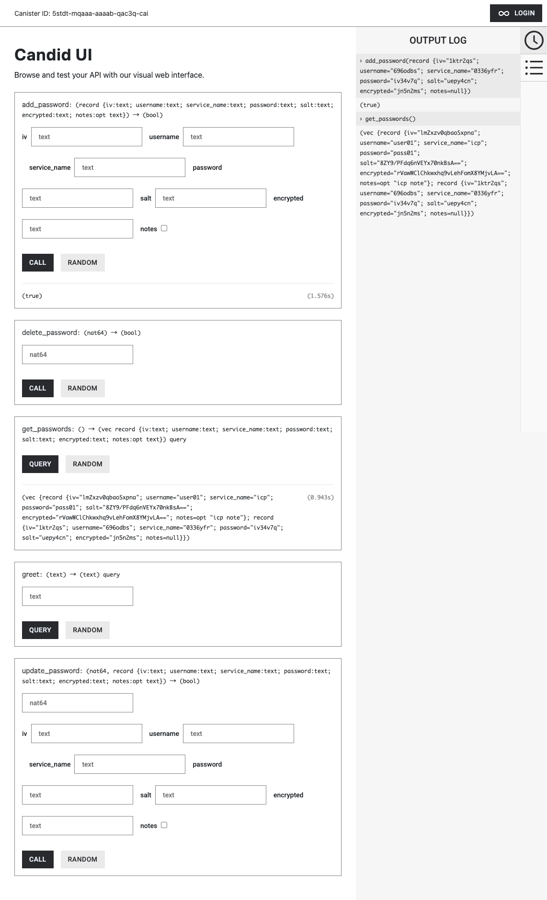
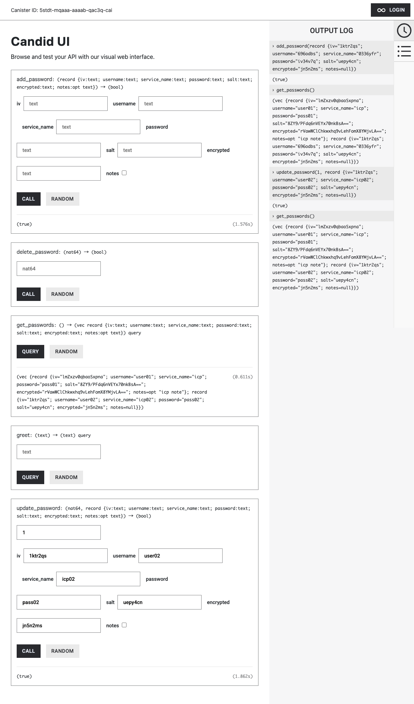
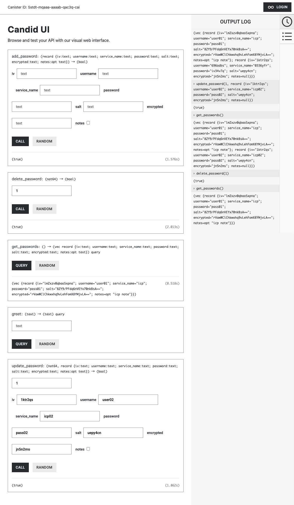
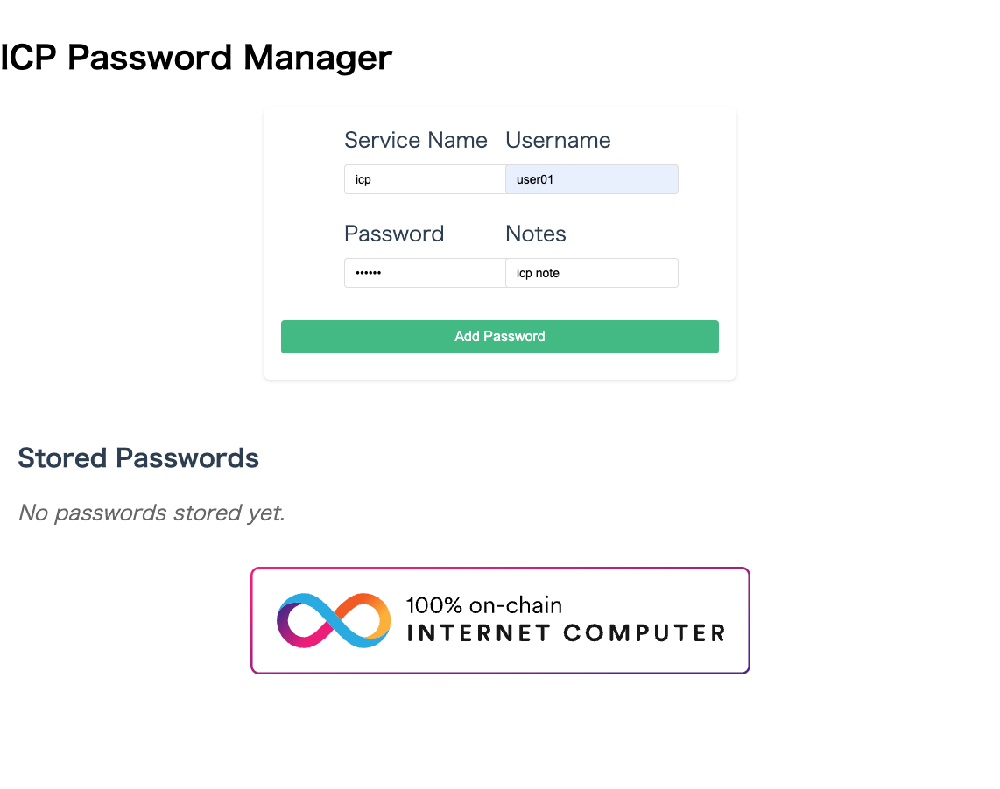
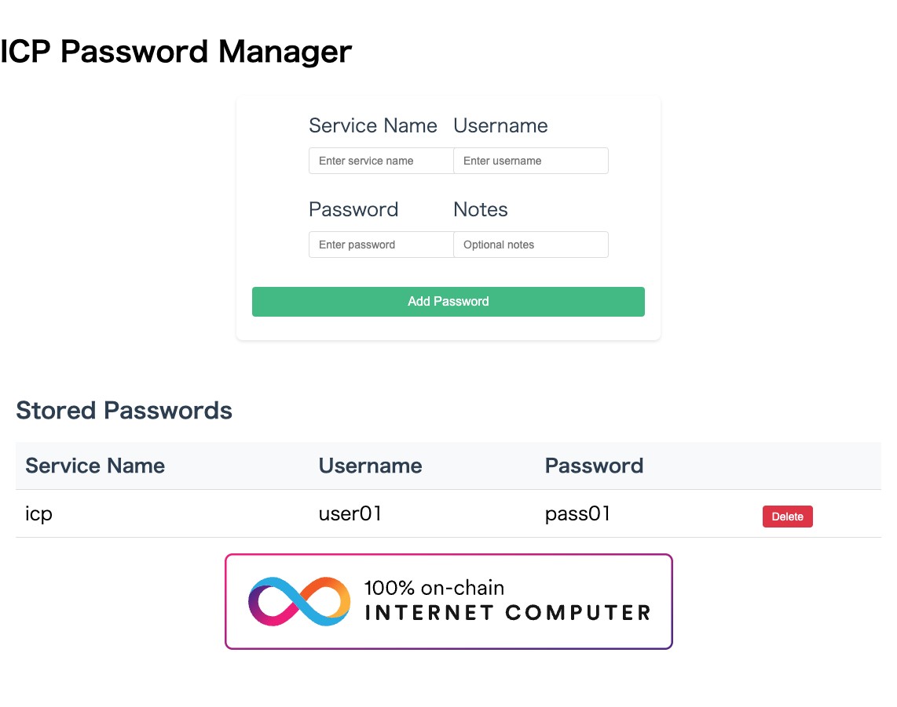

# ICP Password Manager

## 前提条件

### devcontainer を利用する。

1. wave03/dev-icp-hackathon 内をvscode または cursor で開く。
2. devcontainerを開く。

以下の画面の「コンテナーで再度開く」をクリックする。


コンテナ起動後の環境に関しては以下の通り。

```
dfx --version
```

```
dfx 0.25.0
```

最新バージョンにアップデートする方法は以下の通り。

```
dfxvm update
```

cargo のバージョン確認

curl --proto '=https' --tlsv1.2 -sSf https://sh.rustup.rs | sh -s -- -y

```
cargo --version
```

cargo 1.85.0 (d73d2caf9 2024-12-31)


## playground へのDeploy方法

playground へのDeploy 方法は以下の通り。

```
dfx deploy --playground
```

playground へDeployしたcanisterのMethodをコマンドラインから実行することができる。
例えば、playground へDeployした helloproj01_backend canister のMethod: greet をコールする方法は以下の通り。

```
dfx canister --network playground call helloproj01_backend greet '("everyone in playground")'
```

以下のURLが生成されるので、そちらにアクセスする。

```
Upgraded code for canister helloproj01_frontend, with canister ID 475h5-dyaaa-aaaab-qac4a-cai
Deployed canisters.
URLs:
  Frontend canister via browser:
    helloproj01_frontend: https://475h5-dyaaa-aaaab-qac4a-cai.icp0.io/
  Backend canister via Candid interface:
    helloproj01_backend: https://a4gq6-oaaaa-aaaab-qaa4q-cai.raw.icp0.io/?id=5stdt-mqaaa-aaaab-qac3q-cai
```

## Backend canister

まずは、Backend canisterの場合は以下のように表示される。

add_password, get_passwords を実行した結果は以下のとおり。




次に update_password, get_passwords を実行した結果 を実行した結果は以下のとおり。



update_password でindex: 1 を指定して更新した結果が反映されていることが確認できる。




delete_password でindex: 1 を指定して更新した結果が反映されていることが確認できる。

## Frontend canister

次に Frontend canisterの場合は以下のように表示される。

パスワードを入力し、Add Password をクリックする。




パスワード保存に成功した旨のアラートが表示される。


保存結果が一覧に表示される。




## Local Canister実行環境の起動

```
dfx start --clean --background
```

```
Running dfx start for version 0.25.0
Using the default configuration for the local shared network.
Initialized replica.
Initialized HTTP gateway.
Replica API running on 127.0.0.1:4943
Success! The dfx server is running in the background.
```

### Local Canister実行環境へのdeploy

dfx identity use default

```
dfx deploy
```

```
Committing batch with 13 operations.
Deployed canisters.
URLs:
  Frontend canister via browser
    helloproj01_frontend:
      - http://127.0.0.1:4943/?canisterId=bd3sg-teaaa-aaaaa-qaaba-cai
      - http://bd3sg-teaaa-aaaaa-qaaba-cai.localhost:4943/
  Backend canister via Candid interface:
    helloproj01_backend: http://127.0.0.1:4943/?canisterId=be2us-64aaa-aaaaa-qaabq-cai&id=bkyz2-fmaaa-aaaaa-qaaaq-cai
```


## Backend側のテスト実行方法

以下のディレクトリに移動する。

```
cd /src/helloproj01/src/helloproj01_backend
```

テストメソッドを全てテストを実行する方法は以下の通り。

```
cargo test --package helloproj01_backend --test integration_test -- --show-output
```

各テストメソッドごとにテストを実行する方法は以下の通り。

```
cargo test --package helloproj01_backend --test integration_test -- test_hello_world --exact --show-output
cargo test --package helloproj01_backend --test integration_test -- test_add_password --exact --show-output
cargo test --package helloproj01_backend --test integration_test -- test_get_passwords --exact --show-output
cargo test --package helloproj01_backend --test integration_test -- test_update_password --exact --show-output
cargo test --package helloproj01_backend --test integration_test -- test_delete_password --exact --show-output
```

